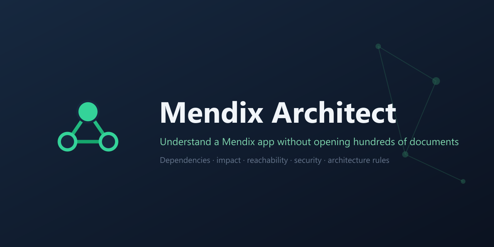
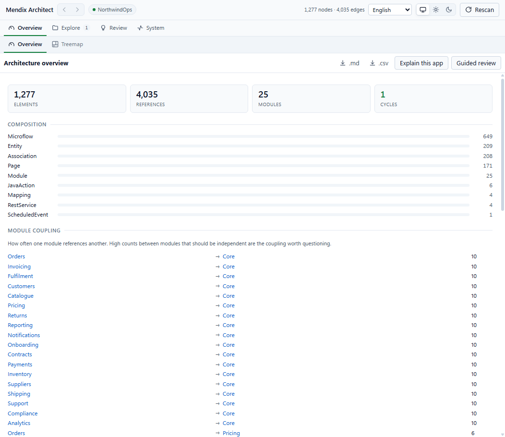
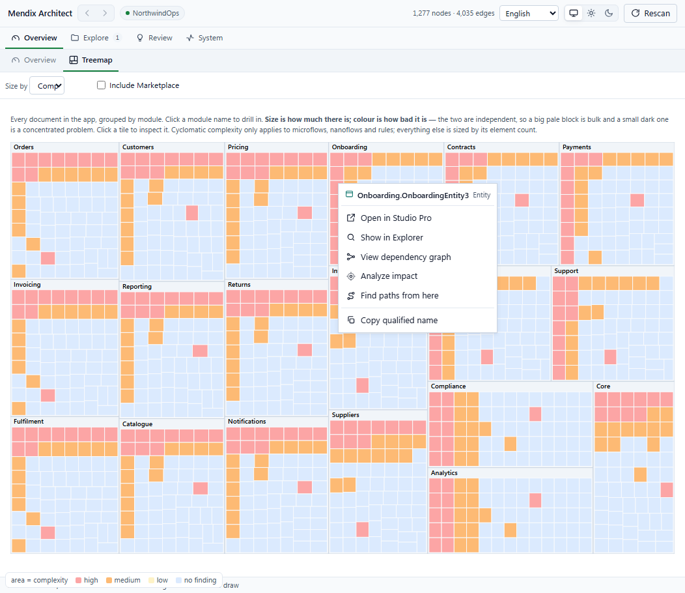
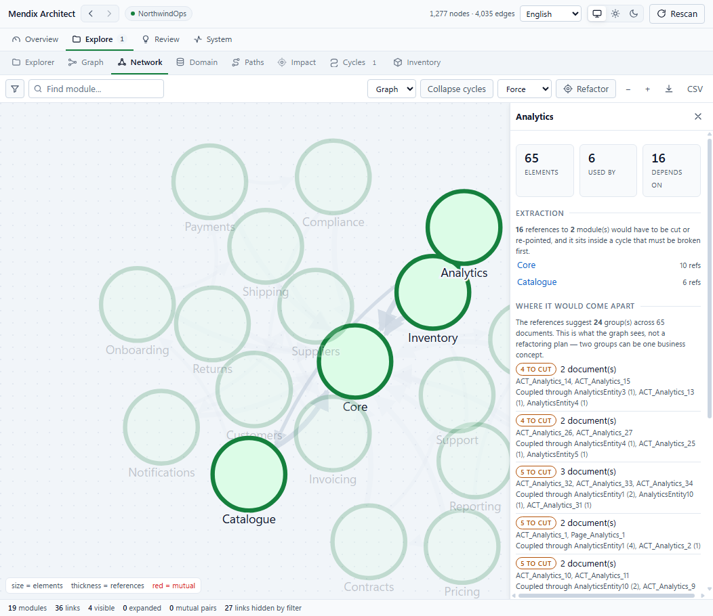
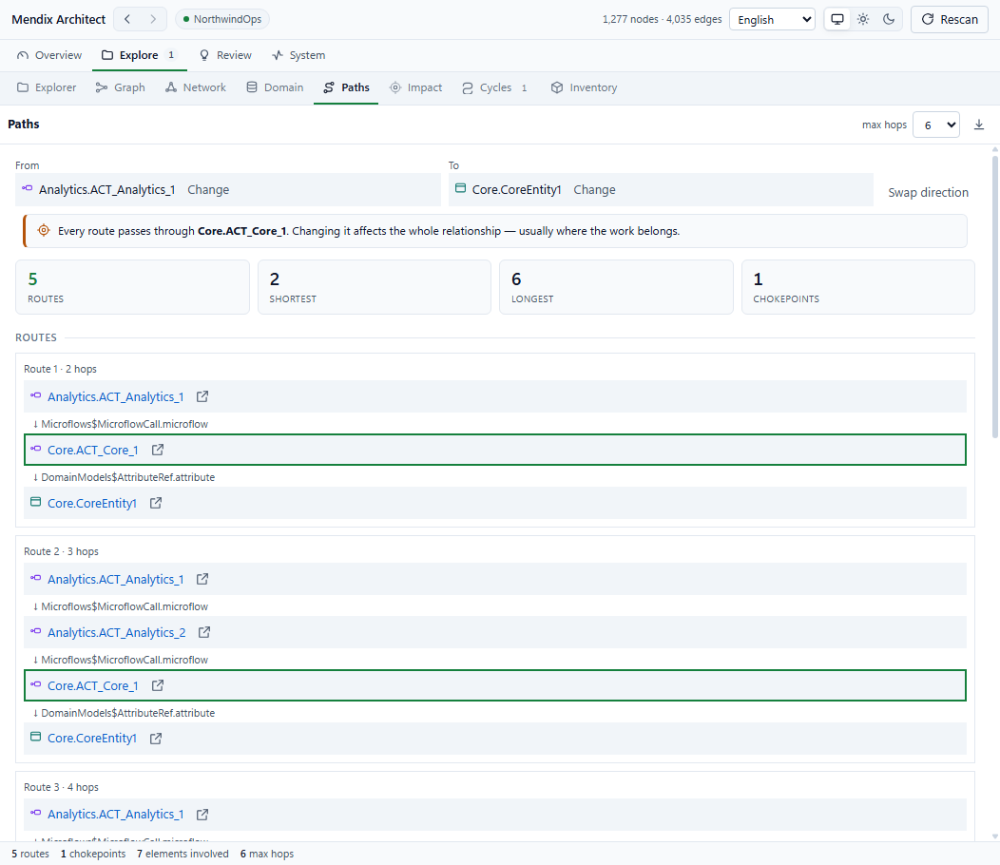
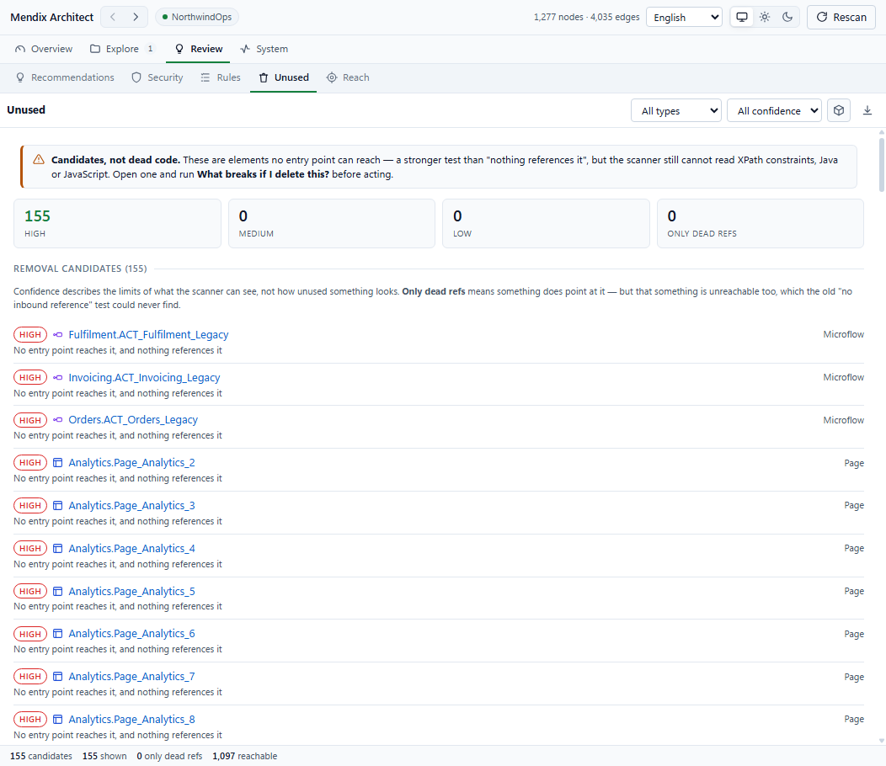
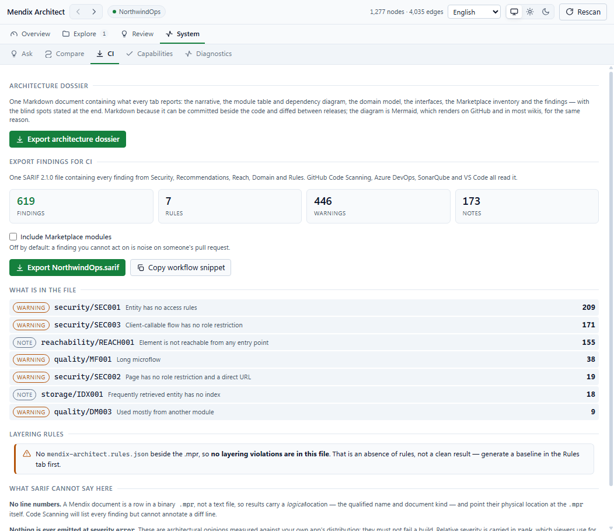

# Mendix Architect

**Understand a Mendix application without opening hundreds of documents.**

A Studio Pro extension for developers, technical leads and solution architects. It scans the
model once and answers the questions that otherwise cost an afternoon of clicking: what
depends on this, what breaks if I change it, what can I safely remove, and how did this app
end up shaped like this.

Verified on Studio Pro **10.24.10** and **11.12.2** from a single build, against a 52 MB app
(2,887 documents / 14,318 references) and a 62-module app (9,258 documents / 58,388
references).

---

## Install

1. Download `MendixArchitect.mxmodule` from this repository.
2. In Studio Pro: **App → Import module package**, select the file.
3. Restart Studio Pro.
4. Open it from **Extensions → Mendix Architect → Open Architect**.

The extension is read-only. It never writes to your model.

---

## Screenshots

All screenshots are of **NorthwindOps**, a demo application built for this purpose. Every
name in them is invented.

| | |
|---|---|
|  |  |
| **Architecture overview** — composition, coupling, cycles | **Treemap** — the whole app, sized by weight, coloured by severity |
|  |  |
| **Module network** — with the cost of extracting a module | **Paths** — every route between two elements, chokepoint named |
|  |  |
| **Removal candidates** — candidates, never "dead code" | **SARIF export** — findings in your pull request |

More: [Explorer](screenshots/04-explorer.png) ·
[Recommendations](screenshots/06-recommendations.png) ·
[Ask](screenshots/09-ask.png) ·
[Dutch](screenshots/10-dutch.png)

---

## What it does

### Find and follow

- **Explorer** — search every document, filter by type and module, with usage counts
- **Find Usages** — reverse dependencies grouped by kind, each showing the property the
  reference came through
- **Impact analysis** — direct and indirect, depth-limited, grouped by type
- **Paths** — every route between two elements, with the chokepoints every route passes
  through
- **Dependency graph** — layered subgraph with lazy expansion and clustering
- **Open in Studio Pro** — jump from any result to the real document

### See the shape of the app

- **Architecture overview** — composition, module coupling, cycles
- **Module network** — force-directed or layered, cycle collapse, dependency-structure matrix
- **Treemap** — the whole app in one picture, sized by weight and coloured by severity
- **Domain model** — entities, associations, and who reads or writes each
- **Coupling and instability metrics** — Martin's I, with tiers derived from your app

### Judge it

- **Recommendations** — what to split, simplify, move or replace, on a refactor quadrant
- **Security analyser** — roles as first-class nodes, five rules, role inventory
- **Reachability** — six kinds of entry point, transitive dead-region detection
- **Unused** — removal candidates with a confidence rating and the reasoning behind it
- **Layering rules** — a checked-in rule file, baseline generation, violations that carry
  their evidence
- **Safe delete** — what breaks, and what is freed, if an element were removed

### Work with it

- **Explain this app** — a written handover summary assembled from the model
- **Guided review** — the architecture review as an agenda, each question carrying its answer
- **Architecture dossier** — every tab's answer in one Markdown document
- **SARIF export** — findings in GitHub Code Scanning, Azure DevOps, SonarQube or VS Code
- **Compare** — what a branch changed architecturally, against a saved scan
- **Ask** — questions in plain language, answered from the measured facts, against a local
  model (Ollama) or any OpenAI-compatible endpoint
- **Dutch** — system menus, buttons and context menus

---

## What it does not claim

This is the part worth reading before you rely on any number in it.

**Impact analysis says "potentially affected", not "broken".** A reference means something
*could* be affected by a change. The model cannot prove that it will break.

**Nothing is ever called dead code.** The Unused tab reports *candidates*, because absence of
a reference in the model is not absence in the running app. Before anything becomes a
candidate, six things are ruled out and counted: Mendix's own `markAsUsed` flag, a non-empty
`url`, exclusion from the app, platform entry points, structural containers, and Marketplace
modules.

**XPath is read lexically, not parsed.** Constraints are plain strings in the model and no
Mendix API parses them. Names inside a constraint are extracted and resolved against the
model, so a false match produces nothing rather than an invented reference. What that cannot
recover is reported rather than hidden.

**Java and JavaScript action bodies are not in the model.** Only the signature is. A Java
action calling another module's logic is not a visible dependency, and no tool built on the
Mendix APIs can see it.

**Thresholds come from your app, not from a rulebook.** "Long" means longer than the 90th
percentile of your own microflows. Every finding shows what was measured and which threshold
it crossed, so it can be argued with.

**Nothing is emitted at severity `error`.** These are architectural opinions measured against
your app's own distribution. They must not fail a build.

Coverage on the larger verification app: **96.2%** of references resolved to a scanned node,
2.2% self-referencing and correctly not drawn, **1.6%** unresolved. Of that 1.6%, all but
0.015% is two structural categories — page-local widget bindings, and Mendix's built-in
`System` module, which is not enumerated as a project module.

---

## Performance

A 52 MB, 2,282-document app scans in **15–20 seconds**. 93% of that is reading properties
from the model, not traversal.

The scan runs off Studio Pro's UI thread, so the IDE stays responsive, and reports live
progress rather than an indeterminate spinner. The result is cached, so everything after the
first scan is instant, and the cache survives restarting Studio Pro.

---

## Privacy

Your model never leaves your machine.

The extension reads the open app and holds the result in memory and in a local cache under
your user profile. Nothing is uploaded, and there is no telemetry.

The optional **Ask** feature is the only thing that makes a network call, and only once you
configure it. It sends a digest of measured facts — counts, module coupling, findings — and
never document contents. Point it at Ollama and nothing leaves the machine at all. If you use
a cloud endpoint, the API key is stored under your local application data, outside the app
folder, and is never sent back to the pane once saved.

---

## Requirements

| | |
|---|---|
| Studio Pro | 10.24.10 or later, including 11.x |
| .NET | 8.0 runtime, shipped with Studio Pro |
| Platform | Windows and macOS |

---

## Documentation

Full guides live in [docs/](docs/README.md).

| Guide | Covers |
|---|---|
| [Getting started](docs/getting-started.md) | Install, first scan, reading the overview |
| [Explore](docs/explore.md) | Explorer, Graph, Network, Domain, Paths, Impact, Cycles, Inventory |
| [Review](docs/review.md) | Recommendations, Security, Rules, Unused, Reach |
| [Reports and CI](docs/reports-and-ci.md) | Explain this app, dossier, SARIF, Compare |
| [Ask](docs/ask.md) | Questions in plain language, local or cloud |
| [What it cannot see](docs/limits.md) | The honest limits, and why each exists |
| [Troubleshooting](docs/troubleshooting.md) | When something looks wrong |

---

## Support

Open an issue on this repository.

When reporting a problem, the **System → Diagnostics** tab reports scan coverage, unresolved
references grouped by property, and the metamodel types it saw. That page is usually enough
to explain what happened without sharing your model.

---

## Licence

Commercial. See [LICENSE](LICENSE). The source is not distributed.

© 2026 Mohamed El Nady. All rights reserved.
